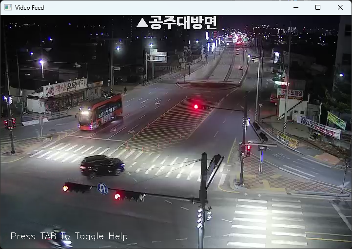
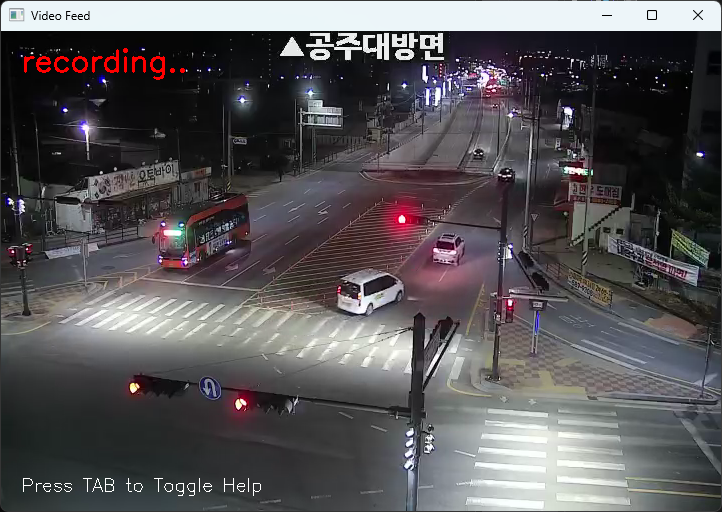
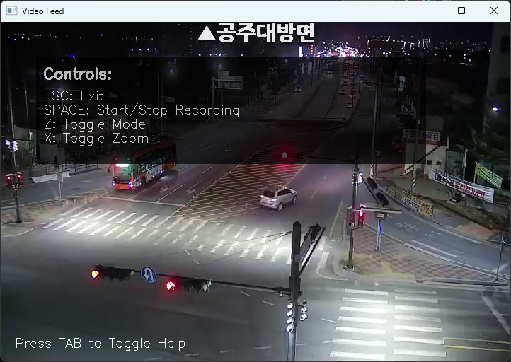
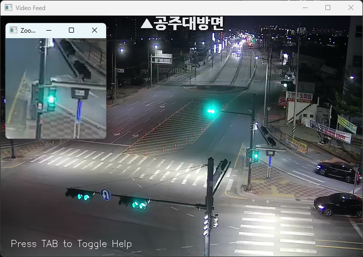
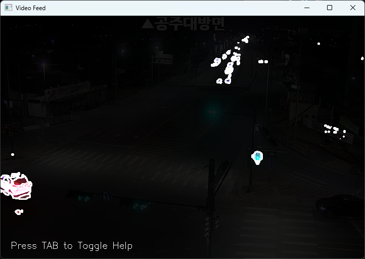

# VideoRecorder

This tool captures and processes live video streams with multiple features including motion detection, recording, and zoom functionality.

### Requirements
- Python 3.13
- OpenCV (`pip install opencv-python`)
- NumPy (`pip install numpy`)

### Controls
- `ESC` : Exit program
- `SPACE` : Start/Stop recording
- `Z` : Toggle between original and processed views
- `X` : Enable/Disable zoom window
- `TAB` : Show/Hide help overlay

### Notes
- All comments are written in Korean.

---

### 프로젝트 개요

개발 인원 : 1명   

개발 기간 : 3일, 2025.03.16 ~ 2025.03.18   

개발 환경   
- language : Python 3.13
- libraries : OpenCV, NumPy
- platform: Windows (Developed & Tested) / macOS / Linux

python의 openCV 라이브러리를 이용하여 제작한 동영상 녹화 프로그램입니다. 공주대방면 cctv의 ip 주소를 통해 실시간으로 받아오는 영상을 출력합니다. mp4 파일로 영상을 녹화하여 저장할 수 있으며, 움직임을 감지하는 기능과 확대 기능을 추가적으로 구현했습니다.

### 결과물 및 성과

### 개선 사항
- 도움말 창 수정
- object detection 퀄리티
- 윈도우 타이틀바 버튼 사용
- 윈도우 확대 막기 (or resize)
- 코드 정리 및 주석 작성
- 단축키 변경
- 실행파일 없음
- README 꾸미기