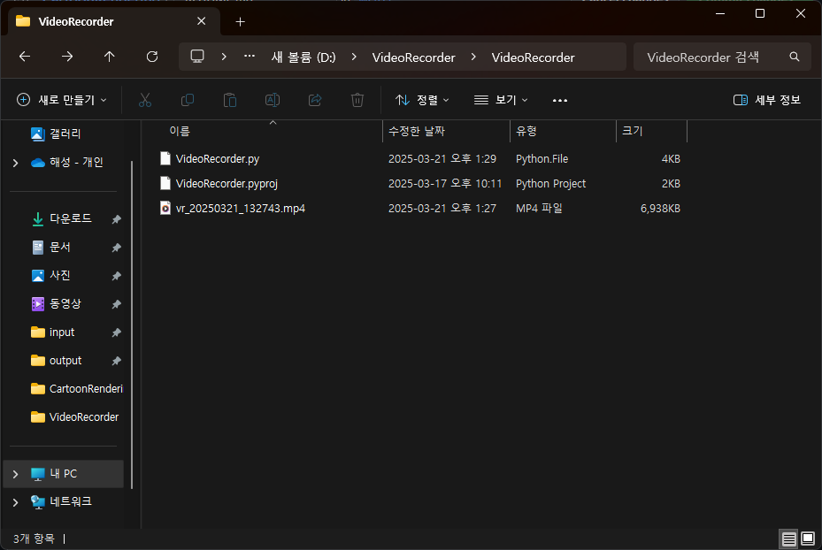
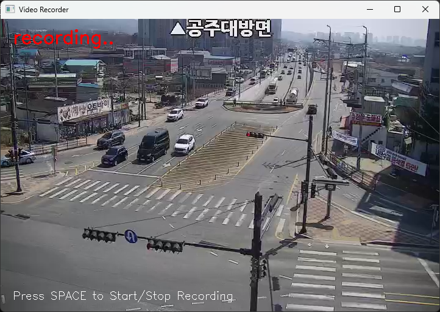

# VideoRecorder

## 📌 1. 프로젝트 개요

Python의 OpenCV 라이브러리를 이용하여 제작한 **실시간 CCTV 스트리밍 녹화 프로그램**입니다. 
공주대 방면 CCTV의 IP 주소를 통해 실시간 영상을 받아와 출력하며, 사용자가 스페이스 키를 누르면 **녹화를 시작/중지**할 수 있습니다. 
또한, **마우스 커서 위치 기반의 확대(Zoom)** 기능을 제공하며, 녹화 중에는 영상 좌측 상단에 **"recording.."** 텍스트가 표시됩니다. 
녹화 파일은 `.mp4` 포맷으로 자동 저장되며, 저장 파일명은 녹화 시각 기준으로 생성됩니다.

### 🛠 개발 환경
- Language : Python 3.13
- Libraries : OpenCV, NumPy
- Platform : Windows (Developed & Tested) / macOS / Linux

### 📡 리소스 출처
**공공데이터포털** (https://www.data.go.kr/index.do)

---

## 📌 2. 결과 분석

영상 스트리밍과 표시, 녹화 기능이 정상적으로 작동함

영상 저장 시 자동으로 파일명을 부여하고, `.mp4` 포맷으로 저장됨

마우스 커서 위치 기반 Zoom 기능도 실시간으로 부드럽게 동작함

녹화 중임을 직관적으로 확인 가능하여 사용자 편의성 향상

---

## 📌 3. 한계점

- 스트리밍 FPS 정보가 정확히 전달되지 않아, `cv2.CAP_PROP_FPS`가 0을 반환하는 경우가 있음
- 일부 시스템에서는 `'mp4v'` 코덱 사용 시 FFmpeg의 timebase 제한으로 인해 `VideoWriter` 생성에 실패할 수 있음
- `cv2.VideoCapture()`가 프레임을 읽지 못할 경우, `NoneType` 오류 발생 가능
- 영상의 해상도와 FPS가 유효하지 않을 경우 녹화가 비정상적으로 종료될 수 있음

---

## 📌 4. 개선 사항

- 🔘 **윈도우 타이틀바 버튼 사용 (최소화/닫기 등)** → GUI 라이브러리 연동 고려
- 🚫 **윈도우 크기 고정** → `cv2.namedWindow()`에 `cv2.WINDOW_AUTOSIZE` 옵션 적용 가능
- ⚙ `VideoWriter` 생성 실패 시 사용자에게 명확한 오류 메시지 출력
- 💡 녹화 상태를 화면뿐만 아니라 로그에도 기록
- 📦 파일 포맷 안정성을 위해 `.avi` + `'MJPG'` 조합 옵션 추가 고려

---

## 📌 5. 결론

본 프로그램은 Python 기반으로 간단하면서도 직관적인 **CCTV 영상 스트리밍 및 녹화 시스템**을 구현하였으며, 
실시간 스트리밍, 영상 녹화, 확대 기능까지 포함된 구조로 다양한 응용이 가능합니다. 
다만, 코덱 및 FPS 관련 시스템 환경 차이에 따라 일부 문제점이 발생할 수 있으며, 
향후 GUI 개선과 예외 처리 강화를 통해 보다 견고한 도구로 발전시킬 수 있을 것입니다.
