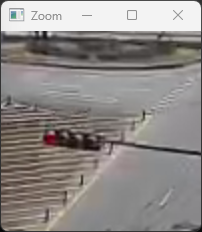

# VideoRecorder

## Description
This tool captures and processes live video streams with multiple features including motion detection, recording, and zoom functionality. 

## Features
-**Live video capture** from a streaming source.
- **Motion detection** using background subtraction.
- **Zoom functionality** to inspect regions of interest.

## Controls
- `ESC` : Exit program
- `SPACE` : Start/Stop recording
- `Z` : Toggle between original and processed views
- `X` : Enable/Disable zoom window
- `TAB` : Show/Hide help overlay

## Requirements
- Python 3.x
- OpenCV (`pip install opencv-python`)
- NumPy (`pip install numpy`)

## Notes

## Screenshot

